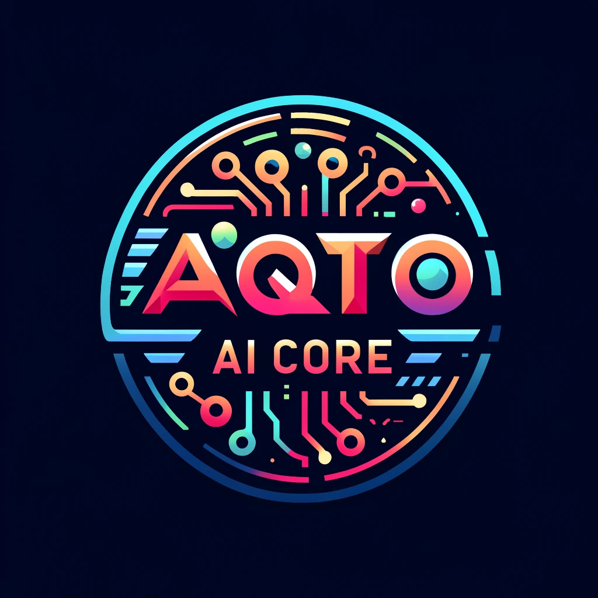

## INTRODUCTION

The Aqto AI Core module provides a base for AI integrations in Drupal 10.

The primary use case for this module is:

- Provide an action system for common site functionality via natural language.
- Extends the action system to allow other modules that leverage shared configurations like API keys.


## INSTALLATION

- Configure `settings.local.php` / `settings.php` to include the following:

```php
$config['aqto_ai_core.settings'] = [
  'openai_api_key' => 'sk-1234567890',
];
```

Install as you would normally install a contributed Drupal module.
See: https://www.drupal.org/node/895232 for further information.

## CONFIGURATION
- Configure the `openai_api_key` in the `aqto_ai_core.settings` configuration.
- Assign the `Administer aqto_ai_core configuration` permission to the appropriate roles.
- Optional: Add the 'Aqto AI Agent' block to a region on your site, and ask it "What can you do?"

## MAINTAINERS

Current maintainers for Drupal 10:

- Tyler Fahey - https://www.drupal.org/u/twfahey

